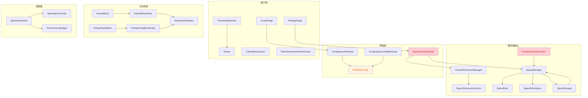
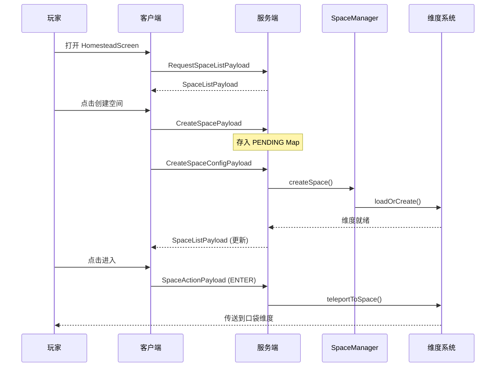

# Pocket Homestead 项目代码审查报告

> **审查日期**: 2026-06-13
> **审查范围**: 全项目源码（src/main/java 下 65 个 Java 文件）
> **审查方法**: 静态代码分析 + 双路交叉验证

---

## 项目概述

**Pocket Homestead** 是一个基于 NeoForge 1.21 的 Minecraft Mod，提供"口袋维度"功能——玩家可以创建私人空间维度，在其中建造和种植。项目涉及动态维度管理、自定义区块生成、物品传输系统、权限管理和客户端 UI 等模块。

### 技术栈

| 项目 | 版本/说明 |
|------|-----------|
| Minecraft | 1.21 |
| NeoForge | 21.1.197 |
| Java | 21 |
| DynamicDimensions | 动态维度管理依赖 |
| Gradle | 9.2.1 (moddev plugin 2.0.141) |

### 模块结构

```
com.pockethomestead
├── PocketHomestead.java          # Mod 入口
├── ModEvents.java                # 全局事件订阅
├── block/                        # 方块定义 (4个)
├── blockentity/                  # 方块实体 (4个)
├── client/                       # 客户端代码
│   ├── page/                     # UI 页面 (CreatePage, ManagePage)
│   ├── screen/                   # Screen 类 (4个)
│   └── ui/                       # UI 框架 (Router, Page, Theme, Widget)
├── command/                      # 命令系统
├── config/                       # 配置管理
├── dimension/                    # 维度管理 (核心)
├── item/                         # 物品定义
├── menu/                         # 菜单/容器 (4个)
├── network/                      # 网络通信 (11个 Payload)
├── registration/                 # 注册表 (6个)
├── scheduler/                    # 调度器 (物品传输、性能预算)
├── space/                        # 空间管理 (核心)
└── util/                         # 常量
```

---

## 架构概览



### 核心业务流程



---

## 问题统计

| 严重级别 | 数量 | 说明 |
|---------|------|------|
| **Critical** | 4 | 功能完全失效、安全漏洞、数据丢失风险 |
| **Major** | 14 | 功能缺陷、性能问题、设计缺陷 |
| **Minor** | 12 | 代码风格、潜在风险、可维护性 |
| **合计** | **30** | |

---

## Critical 问题

### C-1: `spawnOriginalMobs` 方法体为空，生物生成选项永远不生效

| 属性 | 值 |
|------|---|
| **文件** | `dimension/PocketChunkGenerator.java` |
| **行号** | 204-207 |
| **影响** | 即使玩家开启了生物生成选项，口袋维度中也不会有任何生物生成 |

**问题描述**: `spawnOriginalMobs` 方法在 `space != null && space.isMobSpawning()` 为 true 时直接落入方法末尾返回，既没有调用 `super.spawnOriginalMobs(region)` 也没有任何自定义生成逻辑。只有当 `space == null` 或 `!space.isMobSpawning()` 时才提前 return。

**修复建议**: 在 guard check 通过后添加 `super.spawnOriginalMobs(region)` 调用：

```java
@Override
public void spawnOriginalMobs(WorldGenRegion region) {
    SpaceData space = getSpace();
    if (space == null || !space.isMobSpawning()) return;
    super.spawnOriginalMobs(region);  // 添加此行
}
```

---

### C-2: `deleteSpace` 不驱逐维度中的玩家，可能导致玩家卡在已删除维度

| 属性 | 值 |
|------|---|
| **文件** | `space/SpaceManager.java` |
| **行号** | 68-78 |
| **影响** | 如果玩家在空间被删除时仍处于该维度中，可能被卡在无效维度中或导致崩溃 |

**问题描述**: 删除空间时仅卸载维度和移除数据，没有检查和传送仍在该维度中的玩家。`SpaceDimensionService.delete` 仅调用 `DynamicDimensionRegistry.deleteDynamicDimension`，也无玩家驱逐逻辑。

**修复建议**: 在删除空间前，遍历服务器玩家列表，将所有位于该维度的玩家传送回主世界或其返回锚点：

```java
public boolean deleteSpace(MinecraftServer server, UUID spaceId) {
    SpaceData space = spaces.remove(spaceId);
    if (space == null) return false;
    if (!space.getPermission().isOwner(ownerId)) return false;

    // 驱逐维度中的玩家
    ServerLevel level = server.getLevel(space.getDimensionKey());
    if (level != null) {
        for (ServerPlayer player : level.players()) {
            PocketDimensionManager.getInstance().exitToReturnPosition(player);
        }
    }

    SpaceDimensionService.getInstance().delete(server, space);
    SpaceItemRegistry.removeSpace(spaceId);  // 清理注册数据
    return true;
}
```

---

### C-3: 网络包枚举序号反序列化缺少边界检查，恶意客户端可崩溃服务端

| 属性 | 值 |
|------|---|
| **文件** | `network/SpaceActionPayload.java:32`, `network/SpaceInfo.java:52-56`, `network/UpdatePermissionPayload.java:28`, `network/CreateSpacePayload.java:46` |
| **影响** | 恶意客户端发送越界 ordinal 值即可触发 `ArrayIndexOutOfBoundsException`，属于可被远程利用的拒绝服务漏洞 |

**问题描述**: 5 处 STREAM_CODEC 中直接使用网络数据作为数组下标，无边界校验：

- `SpaceActionPayload.java:32` — `ACTION_VALUES[i]`
- `SpaceInfo.java:52` — `TERRAIN_VALUES[ByteBufCodecs.VAR_INT.decode(buf)]`
- `SpaceInfo.java:56` — `MODE_VALUES[ByteBufCodecs.VAR_INT.decode(buf)]`
- `UpdatePermissionPayload.java:28` — `MODE_VALUES[i]`
- `CreateSpacePayload.java:46` — `TERRAIN_VALUES[ByteBufCodecs.VAR_INT.decode(buf)]`

**修复建议**: 在 map 函数中加入边界检查：

```java
// 修复前
ByteBufCodecs.VAR_INT.map(i -> ACTION_VALUES[i], Action::ordinal)

// 修复后
ByteBufCodecs.VAR_INT.map(i -> {
    if (i < 0 || i >= ACTION_VALUES.length)
        throw new DecoderException("Invalid action ordinal: " + i);
    return ACTION_VALUES[i];
}, Action::ordinal)
```

---

### C-4: 命令未设置权限级别，所有子命令对任意玩家开放

| 属性 | 值 |
|------|---|
| **文件** | `command/PocketHomesteadCommand.java` |
| **行号** | 23-24 |
| **影响** | 任何玩家都可以执行 `/pockethomestead create` 创建无限空间消耗服务器资源，`findSpace()` 可枚举所有空间信息 |

**问题描述**: `Commands.literal("pockethomestead")` 之后没有 `.requires()` 调用，Brigadier 默认权限级别为 0（所有玩家可用）。

**修复建议**: 添加权限限制：

```java
Commands.literal("pockethomestead")
    .requires(src -> src.hasPermission(2))  // 添加权限检查
```

---

## Major 问题

### M-1: 玩家返回锚点在断线后未清理，内存泄漏

| 属性 | 值 |
|------|---|
| **文件** | `dimension/PocketDimensionManager.java:29` |
| **影响** | 断线后 `playerAnchors` 中条目永远残留，长期运行服务器内存持续增长 |

**修复建议**: 监听 `PlayerEvent.PlayerLoggedOutEvent`，在回调中调用 `playerAnchors.remove(player.getUUID())`。

---

### M-2: 所有方块实体缺少客户端数据同步机制

| 属性 | 值 |
|------|---|
| **文件** | `blockentity/ExportBlockEntity.java` 等 4 个方块实体 |
| **影响** | `spaceId`、`linked`、`productionRate` 等自定义字段永远不会同步到客户端，客户端 Screen 无法获取最新数据 |

**修复建议**: 在需要客户端显示数据的 BlockEntity 中覆写 `getUpdateTag()` 和 `getUpdatePacket()`，将自定义字段写入同步标签。

---

### M-3: `createStructures` 在 space==null 时仍调用 super 生成结构，可能越界

| 属性 | 值 |
|------|---|
| **文件** | `dimension/PocketChunkGenerator.java:274-280` |
| **影响** | space 为 null 时会在口袋维度中生成原版结构（村庄、神殿等），可能越出空间边界 |

**修复建议**: 改为 `if (space == null || !space.isStructureGeneration()) return;`

---

### M-4: `sealChunk` 使用 `level.setBlock` 替代 `chunk.setBlockState`，性能差

| 属性 | 值 |
|------|---|
| **文件** | `dimension/PocketChunkGenerator.java:298-330` |
| **影响** | 在区块装饰阶段使用 `level.setBlock` 触发方块更新通知，对于大量方块操作（整个区块高度 x 16x16 列）造成严重 TPS 下降 |

**修复建议**: 改用 `chunk.setBlockState(pos, state, false)` 避免触发不必要的方块更新。

---

### M-5: `outlineRound` 方法实现无效——alpha=0 填充无法镂空

| 属性 | 值 |
|------|---|
| **文件** | `client/ui/Theme.java:88-91` |
| **影响** | 描边效果完全失效，最终渲染为实心填充矩形 |

**问题描述**: 第二步使用 `0x00000000`（alpha=0 全透明色）调用 `fillRound`，意图"镂空"内部区域。但 `GuiGraphics.fill()` 使用标准 alpha 混合，alpha=0 的源颜色对目标无影响，底层边框色依然保留。

**修复建议**: 改用四条边分别绘制 1px 宽的线段实现描边，或先绘制 border 色完整圆角矩形再在其内部绘制背景色的圆角矩形来"挖空"中心。

---

### M-6: `setItems` 自引用清空风险

| 属性 | 值 |
|------|---|
| **文件** | `blockentity/ExportBlockEntity.java:76` 等 4 个方块实体 |
| **影响** | 如果调用 `setItems(getItems())`，`clear()` 会同时清空源列表，导致所有物品丢失 |

**修复建议**: 添加引用检查：`if (items != this.items) { this.items.clear(); this.items.addAll(items); }`

---

### M-7: `HomesteadTabletItem` 通过反射调用客户端代码，失败时抛异常崩溃

| 属性 | 值 |
|------|---|
| **文件** | `item/HomesteadTabletItem.java:24-30` |
| **影响** | 使用 `Class.forName` 反射而非 NeoForge 推荐的 `DistExecutor`，编译时无法检查类是否存在，重构时容易遗漏 |

**修复建议**: 使用 `DistExecutor.unsafeRunWhenOn(Dist.CLIENT, () -> () -> ClientScreenHooks.openHomestead())` 替代反射。

---

### M-8: 命令消息使用硬编码中文，无国际化支持

| 属性 | 值 |
|------|---|
| **文件** | `command/PocketHomesteadCommand.java:153-155` |
| **影响** | 所有消息使用 `Component.literal()` + 硬编码中文，非中文用户完全不可读 |

**修复建议**: 使用 `Component.translatable()` + 语言文件。

---

### M-9: `MAX_SPACE_SIZE` 配置上限 30000000 过大

| 属性 | 值 |
|------|---|
| **文件** | `config/ModConfig.java:33` |
| **影响** | 理论上允许创建 30000000 x 64 x 30000000 的空间，错误配置可导致服务器 OOM |

**修复建议**: 降低上限到合理值（如 4096 或 8192），并添加 MIN/MAX 交叉验证。

---

### M-10: `SpaceStorage.deserialize` 静默返回 null，空间数据永久丢失

| 属性 | 值 |
|------|---|
| **文件** | `space/SpaceStorage.java:97-98` |
| **影响** | `catch(Exception)` 返回 null 导致空间数据被静默丢弃，玩家可能丢失整个口袋空间且无恢复手段 |

**修复建议**: 缩小 catch 范围，尝试部分恢复，至少记录损坏的 spaceId。

---

### M-11: `deleteSpace` 不清理 `SpaceItemRegistry` 中对应空间的注册数据

| 属性 | 值 |
|------|---|
| **文件** | `space/SpaceManager.java:68-78` |
| **影响** | 删除空间后 `portalBlocks`、`exportBlocks`、`supplyChests`、`pickupChests` 中的条目不会被清理，造成内存泄漏 |

**修复建议**: 添加 `SpaceItemRegistry.removeSpace(spaceId)` 方法并在删除后调用。

---

### M-12: `fillFromNoise` 中使用 INFO 级别高频日志输出

| 属性 | 值 |
|------|---|
| **文件** | `dimension/PocketChunkGenerator.java:262-265` |
| **影响** | 区块生成时产生数百条 INFO 日志，严重影响性能和日志可读性 |

**修复建议**: 改为 DEBUG/TRACE 级别或移除诊断日志。

---

### M-13: `copyGenerator` 使用 `getOrThrow()` 可能抛出未捕获异常

| 属性 | 值 |
|------|---|
| **文件** | `dimension/SpaceDimensionService.java:113-117` |
| **影响** | 如果原始 ChunkGenerator 不支持完整的序列化/反序列化往返，将抛出异常导致维度创建失败 |

**修复建议**: 先检查 `isSuccessful()`，失败时提供回退方案（如返回默认的 PocketChunkGenerator）。

---

### M-14: `findByDimension` 对全部空间做 O(n) 线性扫描

| 属性 | 值 |
|------|---|
| **文件** | `dimension/SpaceDimensionService.java:69-72` |
| **影响** | 每次调用遍历所有 SpaceData，空间数量增长时性能线性下降 |

**修复建议**: 在 SpaceManager 中增加 `dimensionId -> SpaceData` 的索引 Map，将查找复杂度降为 O(1)。

---

## Minor 问题

### m-1: 单例模式非线程安全

| 属性 | 值 |
|------|---|
| **文件** | `PocketDimensionManager.java:34-37`, `SpaceManager.java:19-22` |
| **建议** | 使用 `volatile` + 双重检查锁定或饿汉初始化 |

### m-2: `applyWorldBorder` 被冗余调用两次

| 属性 | 值 |
|------|---|
| **文件** | `PocketDimensionManager.java:112-117` |
| **建议** | 删除第 117 行的重复调用 |

### m-3: `ConcurrentLinkedQueue.size()` 是 O(n) 操作

| 属性 | 值 |
|------|---|
| **文件** | `PocketDimensionManager.java:72-73` |
| **建议** | 改用固定次数的 poll 循环或 AtomicInteger 跟踪数量 |

### m-4: `isPocketDimension` 与 `isSpaceDimension` 逻辑重复

| 属性 | 值 |
|------|---|
| **文件** | `PocketDimensionManager.java:55-58` |
| **建议** | 统一使用 `SpaceDimensionService.isSpaceDimension()` |

### m-5: `SpaceScheduler` 未在服务器停止时清理

| 属性 | 值 |
|------|---|
| **文件** | `SpaceScheduler.java:15-19` |
| **建议** | 在 `ModEvents.onServerStopped` 中添加清理调用 |

### m-6: `schedulingQueue.contains()` 在 LinkedList 上为 O(n)

| 属性 | 值 |
|------|---|
| **文件** | `SpaceScheduler.java:60` |
| **建议** | 改用 `LinkedHashSet` |

### m-7: `PerformanceBudget.maxMilliPerTick` 声明但从未使用

| 属性 | 值 |
|------|---|
| **文件** | `PerformanceBudget.java:9` |
| **建议** | 实现性能监控逻辑或移除无效配置项 |

### m-8: `markSpaceCompleted` 方法是死代码

| 属性 | 值 |
|------|---|
| **文件** | `SpaceScheduler.java:100-104` |
| **建议** | 删除此未使用的方法 |

### m-9: 四个方块类代码高度重复，违反 DRY 原则

| 属性 | 值 |
|------|---|
| **文件** | `block/ExportBlock.java` 等 4 个方块 + 4 个 Menu |
| **建议** | 提取公共基类 `AbstractHomesteadBlock` 和 `AbstractHomesteadMenu` |

### m-10: `autoDetectSpace` 静默吞掉 UUID 解析异常

| 属性 | 值 |
|------|---|
| **文件** | `blockentity/ExportBlockEntity.java:68-71` |
| **建议** | 替换为日志记录 |

### m-11: `CustomFontManager` 定义的字体资源从未被使用

| 属性 | 值 |
|------|---|
| **文件** | `client/CustomFontManager.java:12-35` |
| **建议** | 在渲染代码中实际使用或移除死代码 |

### m-12: `Router.pages()` 暴露内部可变列表

| 属性 | 值 |
|------|---|
| **文件** | `client/ui/Router.java:19` |
| **建议** | 返回 `Collections.unmodifiableList(pages)` |

---

## 修复优先级建议

### 第一优先级 — Critical（应立即修复）

| 序号 | 问题 | 风险 |
|------|------|------|
| C-1 | `spawnOriginalMobs` 缺少 super 调用 | 核心功能完全失效 |
| C-3 | 网络包枚举序号无边界检查 | 可被远程利用的拒绝服务漏洞 |
| C-2 | 删除空间时不驱逐玩家 | 玩家可能卡死在已删除维度 |
| C-4 | 命令无权限限制 | 可被滥用创建大量空间消耗服务器资源 |

### 第二优先级 — Major（应尽快修复）

| 序号 | 问题 | 风险 |
|------|------|------|
| M-4 | `sealChunk` 使用 `level.setBlock` | 区块生成阶段性能极差 |
| M-10 | 数据反序列化静默丢弃空间 | 玩家可能丢失整个口袋空间 |
| M-11 | 删除空间后注册数据泄漏 | 内存泄漏 |
| M-3 | space==null 时生成越界结构 | 违背空间边界设计意图 |
| M-8 | 命令消息硬编码中文 | 无法国际化 |
| M-7 | 反射调用客户端代码 | 维护性差，重构易遗漏 |

### 第三优先级 — Minor（建议修复）

代码风格和可维护性改进，可根据开发节奏逐步处理。

---

## 附录：审查方法说明

1. **静态分析**: 阅读全部 65 个 Java 源文件，逐模块进行代码审查
2. **双路交叉验证**: 每个发现的问题由 2 个独立子代理分别验证，确认问题真实存在且严重性评估合理
3. **验证维度**: 存在性（问题是否真实存在）、严重性（评级是否合理）、误报检测（是否因缺少上下文导致误判）
4. **置信度**: 所有列入报告的问题均经过 2/2 验证者确认（高置信度）
